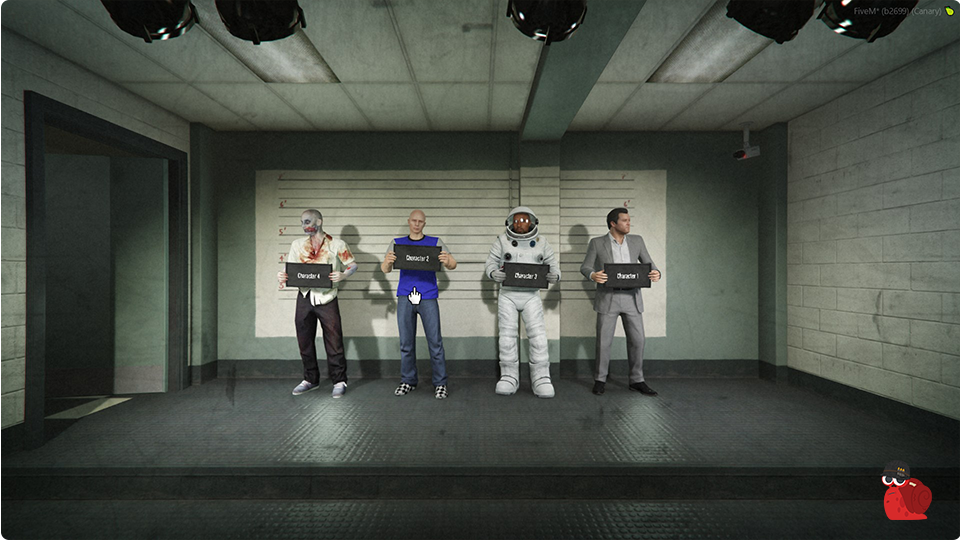

import Tabs from '@theme/Tabs';
import TabItem from '@theme/TabItem';

# fivepunch-multicharacter

---

A lore friendly multi character script for FiveM. 

**Embrace the spirit of Los Santos, @#$% those cute apartments.**

[](https://streamable.com/xp5vhe)

---

## Installation

### Download

After the purchase you will receive an email from Tebex containing the instructions to download the resource.

Alternatively, you can go to https://keymaster.fivem.net/asset-grants and download it.

### Setting up

1. Extract the `fivepunch-multicharacter.pack.zip` file to a folder called `fivepunch-multicharacter` inside your resources folder.

2. Add the following to your `server.cfg` to start the resource. Remember to start the character selection resource before the resource where you will consume it's exports.

  ```cfg
  ensure fivepunch-multicharacter
  ```
3. Start developing!

---

## Integrating

By design, we don't bake framework support in our scripts. All of our creations are standalone, but they can be easily integrated with the framework of your preference.

Here are some examples of how to integrate this script to some of the most common frameworks in the FiveM community.

<Tabs>

<TabItem value="standalone" label="Standalone">

You can check a complete example of the fivepunch-multicharacter resource using instructional buttons [at Fivepunch's Github](https://github.com/fivepunch/fivepunch-multicharacter-example).

</TabItem>

<TabItem value="qb" label="QB">

```lua title="qb-multicharacter/client/main.lua"
local QBCore = exports['qb-core']:GetCoreObject()
local Multicharacter = exports['fivepunch-multicharacter']

local cachedCharacters = {}

function enterCharacterSelection()
    local p = promise.new()

    QBCore.Functions.TriggerCallback("qb-multicharacter:server:setupCharacters", function(characters)
        for i = 1, #characters do
            local character = characters[i]

            QBCore.Functions.TriggerCallback('qb-multicharacter:server:getSkin', function(model, data)
                character.model = model ~= nil and tonumber(model) or 'mp_m_freemode_01'
                character.clothing = json.decode(data)

                table.insert(cachedCharacters, character)

                if i == #characters then
                    p:resolve()
                end
            end, character.citizenid)
        end
    end)

    Citizen.Await(p)

    local characters = {}

    for k, character in pairs(cachedCharacters) do
        table.insert(characters, {
            identifier = character.citizenid,
            name = character.name,
            model = character.model,
        })
    end

    Multicharacter:onCharacterSpawn(function(character)
        for k, cached in pairs(cachedCharacters) do
            if cached.identifier == character.identifier then
                TriggerEvent('qb-clothing:client:loadPlayerClothing', cached.clothing, character.ped)
            end
        end
    end)

    Multicharacter:onCharacterSelect(function(character)
        Multicharacter:flipTheBird(character, function()
            Multicharacter:deleteCharacter(character)
            Multicharacter:setOutOfMulticharacter()

            for k, cached in pairs(cachedCharacters) do
                if character.identifier == cached.citizenid then
                    TriggerServerEvent('qb-multicharacter:server:loadUserData', cached)
                end
            end

            cachedCharacters = {}
        end)
    end)

    Multicharacter:setIntoCharacterSelection(characters)
end

RegisterCommand('exit', function()
    Multicharacter:setOutOfMulticharacter()

    cachedCharacters = {}
end, false)

CreateThread(function()
    while not NetworkIsSessionStarted() do
      Wait(0)
    end

    enterCharacterSelection()
end)

```

</TabItem>
<TabItem value="esx" label="ESX">

```lua
-- To-do
function helloWorld()
  print('Hello, ESX!')
end
```

</TabItem>
<TabItem value="vrp" label="vRP">

```lua
-- To-do
function helloWorld()
  print('Hello, vRP!')
end
```

</TabItem>
</Tabs>

---

## Client exports

### `setIntoCharacterSelection()`

Sets the player into the character selection.

#### Parameters 
```lua title="CharacterData"
local character = { 
  identifier = 1, -- A primitive value
  name = 'Bad Snaily', -- The string that will be displayed in the mugshot board
  model = 'mp_m_freemode_01' -- The character ped model
}
```

```lua title="EnterParameters (optional)"
local parameters = {
  transition = true, -- Enable / disable the transition to the selection screen
  page = 0, -- The starting page of charaters that will be displayed. Max of 4 characters per page
}
```
#### Usage

```lua
  ---@param characters A table of CharacterData
  ---@param parameters An EnterParameters table (optional)
  exports['fivepunch-multicharacter']:setIntoCharacterSelection(characters, parameters)
```

### `nextPage()`

Navigates to the next page of characters if available.

#### Usage

```lua
  exports['fivepunch-multicharacter']:nextPage()
```

### `previousPage()`

Navigates to the next page of characters if available.

#### Usage

```lua
  exports['fivepunch-multicharacter']:previousPage()
```

### `setSelecting()`

Starts selecting a character using the mouse as input.

```lua
  exports['fivepunch-multicharacter']:setSelecting()
```

### `flipTheBird()`

Stops selecting and makes the character ped play a flip the bird animation while leaving the line up room.

#### Parameters 

`Character` [Character](#character)

`Function` (optional)

#### Usage

```lua
  ---@param character A Character table returned from the onCharacterSelect function
  ---@param fn A function that is executed when the animation is completed (optional)
  exports['fivepunch-multicharacter']:flipTheBird(character, function()
    -- Do something ...
  end)
```

### `deleteCharacter()`

Removes the specified character from the selection. No animations, just deletes the ped and removes the caracter of the characters table.

#### Usage

```lua
  ---@param character A Character table returned from the onCharacterSelect function
  exports['fivepunch-multicharacter']:deleteCharacter(character)
```

### `setOutOfMulticharacter()`

Sets the player out of the multicharacter scene (creation or selection)

#### Parameters 

```lua title="ExitParameters (optional)"
local parameters = {
  fadeIn = true, -- If false, it will not fade in the screen after the exiting transition
}
```
#### Usage

```lua
  ---@param parameters An ExitParameters table (optional)
  exports['fivepunch-multicharacter']:setOutOfMulticharacter(parameters)
```

### `setOutOfCharacterSelection()`

:::caution

As of **v1.1.0**, this export is deprecated. Use [`setOutOfMulticharacter`](#setOutOfMulticharacter()) instead.
:::

Does the same as [`setOutOfMulticharacter`](#setOutOfMulticharacter()). This is just a compatibility layer.

#### Parameters 

```lua title="ExitParameters (optional)"
local parameters = {
  fadeIn = true, -- If false, it will not fade in the screen after the exiting transition
}
```
#### Usage

```lua
  ---@param parameters An ExitParameters table (optional)
  exports['fivepunch-multicharacter']:setOutOfCharacterSelection(parameters)
```

### `Character`

A class representing the character inside the selection

#### Properties
- `identifier` The same type as provided in the CharacterData in [setIntoCharacterSelection](#setIntoCharacterSelection)
- `name` String
- `model` String or Hash
- `ped` Number (EntityId)
- `mugshotBoard` [MugshotBoard](#mugshotboard)

### `MugshotBoard`

#### Properties
A class representing the mugshotBoard of each character. You probably shouldn't interact with this.
- `boardProp` Number (EntityId)
- `textProp` Number (EntityId)
- `scaleform` Number (ScaleformId)

### `onCharacterSpawn()`

Sets the callback that will be executed when a character is spawned.

#### Parameters

`Function` Function that receives [Character](#character) as parameter

#### Usage

```lua
  ---@param fn A function that is executed when the character is spawned
  exports['fivepunch-multicharacter']:onCharacterSpawn(function(character)
    -- myFramework.applyCharacterClothing(character.identifier, character.ped) ...
  end)
```

### `onCharacterSelect()`

Sets the callback that will be executed when a character is selected.

#### Parameters

`Function` Function that receives [Character](#character) as parameter

#### Usage

```lua
  ---@param fn A function that is executed when the character is selected
  exports['fivepunch-multicharacter']:onCharacterSelect(function(character)
    -- Do something ...
  end)
```

---

## Common errors
### Error parsing script / Failed to load script

Your server artifacts are likely outdated. Update your server to version 5181 or above.

### You lack the required entitlement to use fivepunch-multicharacter

Try restarting your server and make sure your server license key is correct. If you bought the resource on the wrong account, you can transfer it to another account on keymaster.

### Failed to verify protected resource

Files were possibly corrupted during transfer. Ensure hidden files are copied; the .fxap file in a protected resource must be included. Some FTP programs skip these files.
